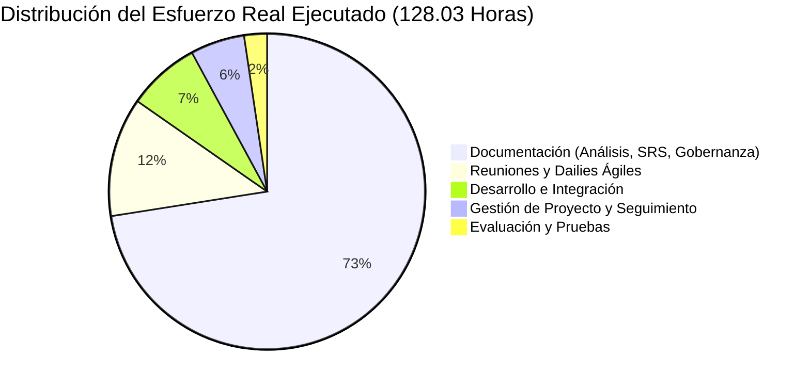
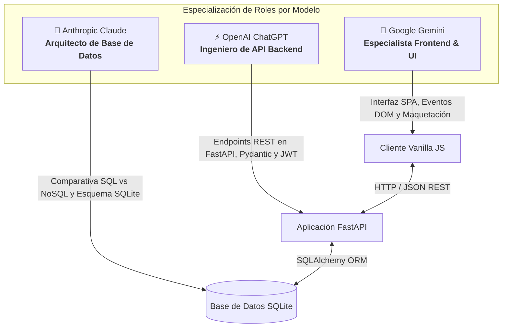

🌐 **Language / Idioma:** [English](README.md) • [Español](README.es.md)

# Azure Nebulas — Caso de Estudio de Gestión de Proyectos de Software y Gobernanza de IA

<p align="center">
  
  
  
  
  
  
</p>

---

## 📌 Resumen Ejecutivo

**Azure Nebulas** es un caso de estudio e investigación académica en **Gestión de Proyectos de Software**, **Ingeniería de Requisitos** y **Gobernanza de Inteligencia Artificial Generativa**, desarrollado en la **Escuela de Ingeniería de Bilbao (UPV/EHU)**.

Lejos de enfocarse únicamente en picar código de forma aislada, este proyecto fue concebido como un análisis empírico sobre cómo un equipo de ingeniería puede gobernar, presupuestar y entregar una plataforma web lista para producción utilizando **modelos de IA generativa como agentes arquitectónicos especializados**, bajo la disciplina de metodologías **Ágiles (Scrum)** y seguimiento riguroso en **OpenProject**.

El equipo entregó con éxito una aplicación web full-stack plenamente operativa (**FastAPI + SQLite + SPA en JavaScript Vanilla**), logrando una reducción del esfuerzo humano planificado del **25,32%** y un ahorro de costes presupuestados del **53,75%** (1.645,40 € ahorrados), documentando todo el ciclo de vida en una **memoria técnica oficial de 26 páginas**.

📄 **[Consultar la Memoria Técnica Final Completa (PDF)](docs/Documentacion_Final_Gestion_Proyectos.pdf)**

---

## 👥 Equipo de Proyecto y Asignación de Roles

Desarrollado en equipo por seis estudiantes del Grado en Ingeniería Informática de Gestión y Sistemas de Información de la **Universidad del País Vasco (UPV/EHU)**:

| Integrante | Rol y Áreas de Responsabilidad Principal |
| :--- | :--- |
| **Aimar Larriba Manzano** | **Ingeniería de Requisitos (User Stories), Gestión de Alcance, Plan de Control de Riesgos y Co-autor de la Documentación Final** |
| Jon Requies Ruiz | Gobernanza del Proyecto, Planificación de Sprints y Cronograma |
| Pablo Fernández González | Control de Calidad, Métricas de Testing y Evaluación Técnica |
| Shaman Alonso Amezcua | Arquitectura Frontend y Liderazgo de Integración de API |
| Marcos Cobo Gutiérrez | Arquitectura Backend, Administración del Repositorio y Seguridad |
| Adrián Vinagre Castelló | Documentación Técnica, Despliegue y Orquestación del Entorno |

---

## 📊 Planificación Inicial vs. Ejecución Real

### 1. Métricas de Esfuerzo y Presupuesto (Seguimiento en OpenProject)
El progreso del proyecto se controló mediante paquetes de trabajo en **OpenProject**, contrastando la dedicación horaria real frente a las estimaciones de la línea base acordadas mediante **Planning Poker**:

| Fase / Dimensión del Proyecto | Esfuerzo Planificado (Horas) | Esfuerzo Real Ejecutado (Horas) | Desviación (Horas) |
| :--- | :---: | :---: | :---: |
| **A. Documentación** | 70,34 h | 92,83 h | $+22,49\text{ h}$ |
| **B. Evaluación y Pruebas** | 12,00 h | 3,00 h | $-9,00\text{ h}$ |
| **C. Desarrollo** | 45,00 h | 9,50 h | $-35,50\text{ h}$ |
| **D. Gestión del Proyecto** | 16,00 h | 7,10 h | $-8,90\text{ h}$ |
| **E. Reuniones de Equipo y Dailies**| 28,10 h | 15,60 h | $-12,50\text{ h}$ |
| **TOTAL** | **171,44 h** | **128,03 h** | **$-43,41\text{ h}$ (-25,32%)** |



### 2. Impacto Económico y Ahorro Presupuestario
* **Presupuesto Estimado Inicial (Fase 2):** **3.060,85 €**
* **Coste Real Ejecutado (Fase Final):** **1.415,45 €**
* **Ahorro Económico Total:** **1.645,40 € (53,75% de optimización presupuestaria)**
* **Causa Raíz de la Desviación:** La IA generativa aceleró drásticamente la creación de código base y plantillas, reduciendo las horas de desarrollo de 45,00h a 9,50h. El esfuerzo del equipo se reinvirtió estratégicamente en elaborar especificaciones funcionales exhaustivas, refinamiento de casos de uso y mitigación de riesgos.

---

## 🛡️ Plan de Control y Gestión de Riesgos

El proyecto implementó una **Matriz de Riesgos formal (R-1 a R-10)** auditada semanalmente:

| ID Riesgo | Categoría | Descripción del Riesgo | ¿Materializado? | Acción de Contingencia Tomada |
| :---: | :--- | :--- | :---: | :--- |
| **R-1** | Organizacional | Conflictos internos del equipo | ❌ No | Prevenido mediante reuniones de consenso y dailies. |
| **R-2** | Gestión | Retrasos en el calendario de entregas |  **Sí (Semana 6)** | Error de cálculo de fechas detectado; contingencia activada reasignando horas y sincronizando sprints en OpenProject. |
| **R-3** | Gestión | Olvido de subir entregables a OpenProject | ❌ No | Doble protocolo de auditoría en los sprint plannings. |
| **R-4** | Técnico | Corrupción o pérdida de archivos | ❌ No | Repositorio Git centralizado con ramas protegidas. |
| **R-5** | Técnico | Falta de conocimientos en el stack | ❌ No | Resuelto mediante ingeniería de prompts para tutoriales de frameworks. |
| **R-6** | Técnico | La IA es incapaz de resolver una tarea | ❌ No | Protocolo de fallback con contraste entre múltiples modelos. |
| **R-7** | Organizacional | Miembro ausente en la presentación final |  **Sí (Semana 9)** | Contingencia activada: diapositivas redistribuidas de inmediato sin impacto en la exposición. |
| **R-8** | Organizacional | Desviación de alcance / tareas redundantes |  **Sí (Semana 8)** | Tareas repetidas eliminadas; congelación de alcance para evitar *goldplating*. |
| **R-9** | Aprendizaje | Tareas incompletas al cierre del sprint | ❌ No | Monitorización continua del burndown chart. |
| **R-10**| Organizacional | Falta de participación de un integrante | ❌ No | Cohesión grupal mantenida a lo largo de todo el cuatrimestre. |

---

## 🤖 Benchmarking Empírico de IA Generativa

Para evitar alucinaciones y dispersión, el proyecto definió un **protocolo de especialización por modelo**, evaluando a cada IA en tres dimensiones: *Viabilidad Operativa*, *Calidad Técnica* y *Capacidad de Corrección*:



### Lecciones Aprendidas en Ingeniería Asistida por IA:
1. **El Problema de la Pérdida de Contexto:** Generar código en chats aislados provocaba discrepancias en nombres de variables y formatos JSON. **Solución:** Se designó Git como la única fuente de verdad; los prompts se alimentaron con los archivos reales del repositorio para mantener contratos de interfaz estables.
2. **Evitar el *Goldplating*:** Los modelos de IA tienden a sugerir funcionalidades adicionales innecesarias. El equipo validó estrictamente los requisitos para no inflar el alcance.
3. **El Pico de Integración de la Semana 8:** Aunque los componentes individuales se generaron rápido, conectar el frontend y el backend generados por modelos distintos produjo un pico de esfuerzo en la semana 8, demostrando que la integración humana sigue siendo el paso crítico.

---

## 💻 Arquitectura del Producto Entregado

El entregable final es una plataforma web de **Gestión de Videoteca y Catálogo de Películas**:
* **Backend:** **FastAPI** con ORM **SQLAlchemy**, esquemas de validación **Pydantic**, tokens de acceso **JWT** (`python_jose`) y hashing de contraseñas con **passlib**.
* **Frontend:** Single-Page Application (SPA) en **HTML5, CSS3 y JavaScript Vanilla**.
* **Base de Datos:** Relacional **SQLite** (`videoteca.db`).
* **Funcionalidades:**
  * Control de acceso basado en roles (**Administrador** vs. **Usuario estándar**).
  * CRUD completo del catálogo de películas para administradores.
  * Listas de visualización personalizadas e historial de películas vistas.
  * Documentación interactiva Swagger / OpenAPI accesible en `/docs`.

---

## ⚙️ Cómo Ejecutar la Aplicación

### 1. Clonar el repositorio e instalar dependencias
```bash
git clone https://github.com/aimarlarriba/azure-nebulas-project-management.git
cd azure-nebulas-project-management

# Crear y activar entorno virtual
python -m venv venv
# En Windows:
venv\Scripts\activate
# En Linux/macOS:
source venv/bin/activate

# Instalar dependencias
pip install -r requirements.txt
```

### 2. Arrancar el servidor Backend FastAPI
```bash
cd backend
uvicorn main:app --reload
```
* La base de datos SQLite (`videoteca.db`) se creará automáticamente en el primer arranque.
* Documentación interactiva de la API disponible en: **`http://localhost:8000/docs`**

### 3. Abrir la interfaz Frontend
Abre `frontend/index.html` en tu navegador web (o sírvelo con cualquier servidor local estático como Live Server o `python -m http.server 3000`).

---

## 📄 Entregables Documentales

* 📘 **[Documentacion_Final_Gestion_Proyectos.pdf](docs/Documentacion_Final_Gestion_Proyectos.pdf)**: Memoria académica oficial de 26 páginas con objetivos, análisis de desviaciones presupuestarias, seguimiento de riesgos y conclusiones.
* 📕 **[Análisis de la IA Generativa.pdf](docs/Análisis%20de%20la%20IA%20Generativa.pdf)**: Estudio comparativo empírico sobre el rendimiento de Claude, ChatGPT y Gemini.

---

## ⚖️ Licencia y Contexto Académico

Desarrollado en el marco académico de la **Escuela de Ingeniería de Bilbao (UPV/EHU)** para la asignatura de *Gestión de Proyectos* (Curso 2025/2026). Publicado con fines didácticos como caso de estudio de gobernanza y gestión de software.
