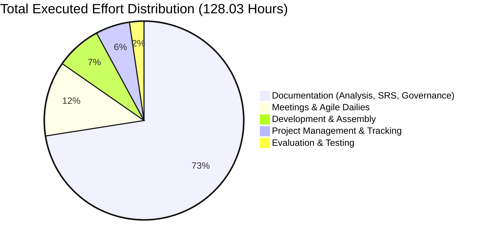
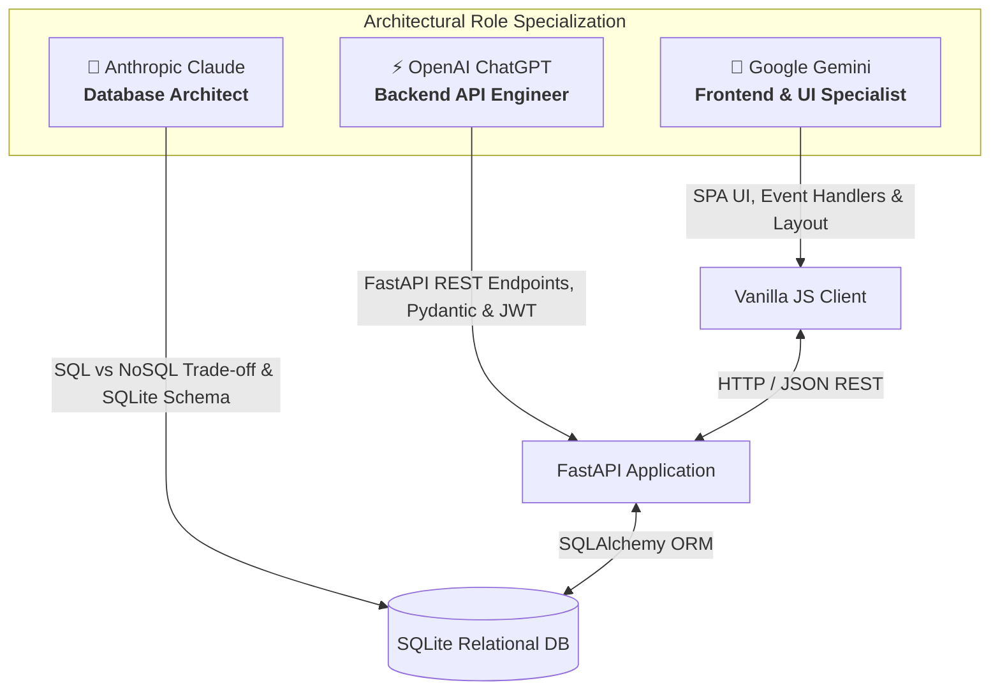

🌐 **Language / Idioma:** [English](README.md) • [Español](README.es.md)

# Azure Nebulas — Software Project Management & Generative AI Governance Case Study

<p align="center">
  
  
  
  
  
  
</p>

---

## 📌 Executive Summary

**Azure Nebulas** is an academic case study and research project in **Software Project Management**, **Requirements Engineering**, and **Generative AI Governance** developed at the **Bilbao School of Engineering (UPV/EHU)**.

Rather than approaching software construction purely from a manual programming perspective, this project was designed as an empirical investigation into how modern engineering teams can govern, budget, and deliver a production-grade web platform by leveraging **Generative AI models as specialized architectural agents** under strict **Agile Scrum methodologies** and **OpenProject governance**.

The team successfully delivered a fully functional full-stack web application (**FastAPI + SQLite + Vanilla JS SPA**) while reducing planned human effort by **25.32%** and cutting projected project costs by **53.75%** (€1,645.40 saved), documenting the full lifecycle in an official **26-page technical report**.

📄 **[Read the Official Final Project Report (PDF)](docs/Documentacion_Final_Gestion_Proyectos.pdf)**

---

## 👥 Project Team & Role Allocation

Developed collaboratively by a team of six Computer Management and Information Systems Engineering students at the **University of the Basque Country (UPV/EHU)**:

| Team Member | Core Focus & Responsibilities |
| :--- | :--- |
| **Aimar Larriba Manzano** | **Requirements Engineering (User Stories), Scope Management, Risk Control Plan & Co-Author of Final Documentation** |
| Jon Requies Ruiz | Project Governance, Sprint Planning & Scheduling |
| Pablo Fernández González | Quality Assurance, Testing Metrics & Technical Evaluation |
| Shaman Alonso Amezcua | Frontend Architecture & API Integration Lead |
| Marcos Cobo Gutiérrez | Backend Architecture, Repository Administration & Security |
| Adrián Vinagre Castelló | Technical Documentation, Deployment & Environment Orchestration |

---

## 📊 Project Management Baseline vs. Actual Execution

### 1. Effort & Budget Metrics (OpenProject Tracking)
Project progress was monitored using **OpenProject** work packages, tracking daily hour allocations against baseline estimates derived via **Planning Poker**:

| Project Phase / Dimension | Planned Effort (Hours) | Actual Executed Effort (Hours) | Deviation (Hours) |
| :--- | :---: | :---: | :---: |
| **A. Documentation** | 70.34 h | 92.83 h | $+22.49\text{ h}$ |
| **B. Evaluation & Testing** | 12.00 h | 3.00 h | $-9.00\text{ h}$ |
| **C. Development** | 45.00 h | 9.50 h | $-35.50\text{ h}$ |
| **D. Project Management** | 16.00 h | 7.10 h | $-8.90\text{ h}$ |
| **E. Team Meetings & Dailies**| 28.10 h | 15.60 h | $-12.50\text{ h}$ |
| **TOTAL** | **171.44 h** | **128.03 h** | **$-43.41\text{ h}$ (-25.32%)** |



### 2. Economic Impact & Cost Savings
* **Baseline Estimated Budget (Phase 2):** **€3,060.85**
* **Actual Realized Cost (Final Phase):** **€1,415.45**
* **Total Economic Savings:** **€1,645.40 (53.75% budget optimization)**
* **Root Cause of Deviation:** Generative AI dramatically accelerated code scaffolding and boilerplate generation, compressing development hours from 45.00h to 9.50h. In response, team effort was strategically reinvested into comprehensive architectural documentation, use-case specifications, and risk mitigation.

---

## 🛡️ Risk Management & Mitigation Framework

The project instituted a formal **10-Point Risk Register (R-1 to R-10)** audited weekly:

| Risk ID | Category | Description | Materialized? | Contingency Action Taken |
| :---: | :--- | :--- | :---: | :--- |
| **R-1** | Organizational | Team internal conflicts | ❌ No | Prevented through frequent consensus meetings. |
| **R-2** | Management | Delivery schedule slips |  **Yes (W6)** | Date miscalculation identified; contingency activated to reallocate hours and synchronize OpenProject sprints. |
| **R-3** | Management | Missing OpenProject work packages | ❌ No | Double-audit protocol established during sprint plannings. |
| **R-4** | Technical | Project file corruption | ❌ No | Centralized Git repository with remote branch protection. |
| **R-5** | Technical | Knowledge gaps in required tech stack | ❌ No | Resolved by prompt-engineering AI for framework tutorials. |
| **R-6** | Technical | GenAI model unable to solve task | ❌ No | Multi-model fallback protocol established. |
| **R-7** | Organizational | Member absent on final presentation |  **Yes (W9)** | Emergency contingency activated: slides redistributed among attending members with zero disruption. |
| **R-8** | Organizational | Scope creep / unrealistic ambition |  **Yes (W8)** | Duplicate tasks pruned; scope frozen to prevent goldplating. |
| **R-9** | Learning | Incomplete sprint deliverables | ❌ No | Continuous monitoring prevented milestone delays. |
| **R-10**| Organizational | Member non-participation | ❌ No | Maintained high cohesion throughout the semester. |

---

## 🤖 Empirical Generative AI Benchmarking

To prevent chaotic multi-agent hallucinations, the project established a **specialized model delegation protocol**, assigning discrete architectural domains based on three benchmark dimensions: *Operational Viability*, *Technical Quality*, and *Correction Capability*:



### Key Engineering Lessons in AI-Assisted Development:
1. **The Context Drift Problem:** Generating code in isolated chat sessions resulted in divergent data interchange schemas and mismatched variable names. **Solution:** Git was designated as the single source of truth; prompts were injected with existing codebase files to maintain interface contracts.
2. **Goldplating Prevention:** AI models frequently suggest unsolicited technical features. The team strictly enforced the initial Requirements Baseline to avoid scope bloat.
3. **The Week 8 Integration Spike:** While individual components generated instantly, assembling frontend and backend modules generated by different models caused a notable effort spike in Week 8, highlighting integration testing as the core human bottleneck.

---

## 💻 Delivered Product Architecture

The final deliverable is an interactive **Movie Vault & Streaming Management Platform**:
* **Backend:** **FastAPI** with **SQLAlchemy ORM**, **Pydantic** data validation schemas, **JWT** access tokens (`python_jose`), and **passlib** password hashing.
* **Frontend:** Single-Page Application (SPA) in **HTML5, CSS3, and Vanilla JavaScript**.
* **Database:** Relational **SQLite** (`videoteca.db`).
* **Functional Capabilities:**
  * Strict Role-Based Access Control (**Admin** vs. **Standard User**).
  * Full Movie Catalog CRUD (Create, Read, Update, Delete) for administrators.
  * Personalized user watchlists, view history logging, and custom playlist creation.
  * Interactive Swagger / OpenAPI documentation endpoint at `/docs`.

---

## ⚙️ How to Run the Delivered Application

### 1. Clone repository and install dependencies
```bash
git clone https://github.com/aimarlarriba/azure-nebulas-project-management.git
cd azure-nebulas-project-management

# Create and activate virtual environment
python -m venv venv
# On Windows:
venv\Scripts\activate
# On Linux/macOS:
source venv/bin/activate

# Install dependencies
pip install -r requirements.txt
```

### 2. Start the FastAPI Backend Server
```bash
cd backend
uvicorn main:app --reload
```
* The SQLite database (`videoteca.db`) will auto-initialize upon first launch.
* Interactive API Documentation will be available at: **`http://localhost:8000/docs`**

### 3. Open the Frontend Application
Open `frontend/index.html` in your web browser (or serve it via any static file server like VS Code Live Server or `python -m http.server 3000`).

---

## 📄 Documentation Deliverables

* 📘 **[Documentacion_Final_Gestion_Proyectos.pdf](docs/Documentacion_Final_Gestion_Proyectos.pdf)**: Official 26-page academic report covering initial objectives, budget variances, risk tracking, and organizational conclusions.
* 📕 **[Análisis de la IA Generativa.pdf](Análisis%20de%20la%20IA%20Generativa.pdf)**: Empirical evaluation study on LLM utility across frontend, backend, and database domains.

---

## ⚖️ License & Academic Notice

Developed under the academic framework of the **Bilbao School of Engineering (UPV/EHU)** for the *Gestión de Proyectos* course (Academic Year 2025/2026). Published as an educational case study in software engineering governance.
